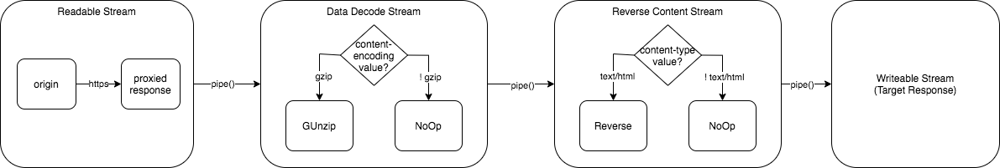

### Pre-requisite
* Node version 10 or above
* `/usr/bin/node` exists OR use `node reverseme <domain>` instead

### How-to Run

```
git clone git@github.com:c2pig/reverse-me.git && cd reverse-me
chmod a+x reverseme
./reverseme bbc.com
```

### Debugging
Two set of logging output for debug purpose
* `app.stream` -- stream processor logging
* `app.network` -- request/response logging

Example: Turn on all logging
```
export NODE_DEBUG=app*
./reverseme bbc.com
```

---

### Appendix

#### :pushpin: Coding Principle
> Learn the hard way -- Have no for Node external library

#### :pushpin: Solution-Options
##### Option 1: In-memory processing
Fetched response is stored in memory for processing until write to target response
> Pros
- Simple implementation
- Debugging is easier

> Cons
- Longer network idle due to read and write ops is synchronous
- No flow-control (eg: `<head>` can be return to target before `<body>` parsing)
- Spike in memory usage if traffic volume is "high"

  
##### Option 2: :white_check_mark:  Stream-based processing :white_check_mark: 
> Pros
- Memory efficient 
- Scalable approach for more processing logics or network efficiency to be introduced

> Cons
- Complicated solution
- Debugging is hard

#### :pushpin: High level diagram


#### Test Data

Purpose: Manual test application behaviour against different content-encoding, content-language, content-length and redirection for following sites:
* bbc.com
* google.com
* yahoo.com
* dev.to
* imdb.com
* baidu.com


#### :pushpin: Known Bugs

* yahoo.com main content cannot display (could be due to `/serviceworker.js` return 404
* An `undefined` prepend `<html>..</html>` 


#### :pushpin: Lesson Learnt
| Challenge | What does it mean? |
| --- | ----------- |
|HTTP Redirection handling | Redirect chain in `Promise` is error-prone and difficult to troubleshoot the error.  Life will be easier if library such as `request`, `node-fetch` is used for handling it.|
|`flush(cb)` vs `flush: () => {}` | Lexical scope issue caused by overlooked syntax.|
|backpressure |`proxiedRes.pipe(reverse()).pipe(res)` could not cater for large content size from imdb.com(due to in-line base64 images).  Change to `pipeline(streams...)` fix the issue.|
|Dom Traversal|Initial reverse content implementation was used `node-html-parser` for dom navigation and manipulation.  To reduce dom traversing time, a hacky way used to inject reversing styles apply to `<body>` and `` |
 
